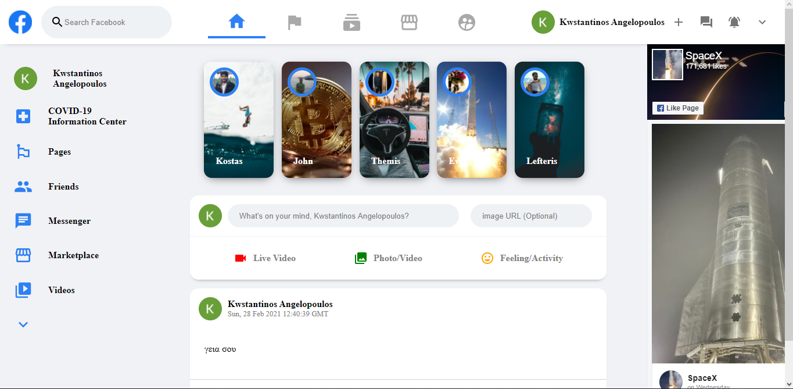

# Facebook Clone

A clone of Facebook Home page using [React JS/React JS Context API](https://reactjs.org) for the front-end and [Firebase](firebase.google.com) for the back-end. Inspired by [this tutorial](https://www.youtube.com/watch?v=B-kxUMHBxNo&t=337s)

<div align="center">
  <h1><a href="http://kangelopoulos.ddns.net/facebook"> DEMO </a></h1>
</div>

## Requirements

Inside the repo there is a [.env.example file](./facebook/.env.example). Rename it to .env and fill the values with your own api keys.

For firebase you will need a firebase config file from your webapp with the following values.

```javascript
REACT_APP_FIREBASE_API_KEY=
REACT_APP_FIREBASE_AUTH_DOMAIN=
REACT_APP_FIREBASE_PROJECT_ID=
REACT_APP_FIREBASE_STORAGE_BUCKET=
REACT_APP_FIREBASE_MESSAGING_SENDER_ID=
REACT_APP_FIREBASE_APP_ID=
REACT_APP_FIREBASE_MEASUREMENT_ID=
```

## Installation

Assuming you have [npm](https://www.npmjs.com) installed, clone the repo and run the following code:

```
npm install
```

## Usage

Inside the cloned folder run:

```
npm start
```

## Example

<p align="center">
   
</p>
